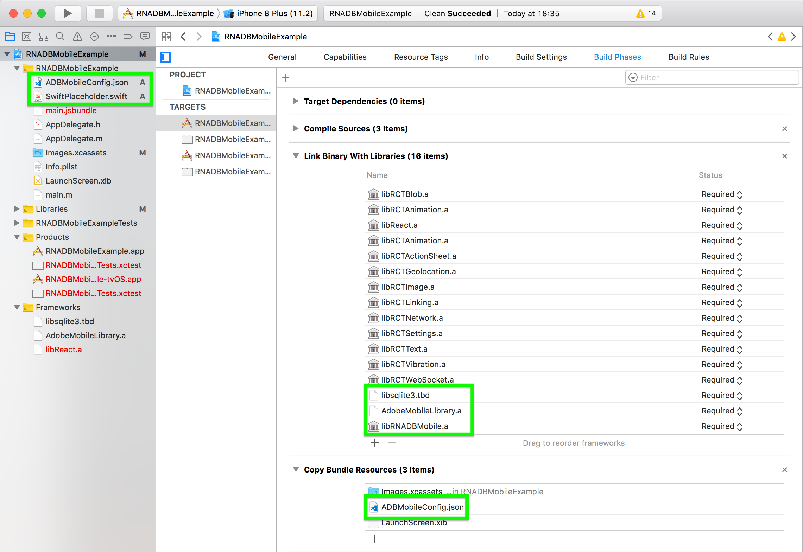

# iOS SDK

Like the Android version which is mostly automatic using Gradle,
the iOS version leverages CocoaPods, however one must use the
local version:

```
target 'YourTargetApp' do
  # ... existing stuff
  pod 'RNADBMobile', path: '../node_modules/react-native-adbmobile/ios'
end
```

# Non-CocoaPod setup

Remember to link to the correct libraries as in the image:



## Libraries

This project uses yarn package `adobe-mobile-services`
to fetch the library, that project is meant to be used by
Cordova/PhoneGap applications, but the iOS library is
the same.

The application must be linked to:
```
libsqlite3.tbd
AdobeMobileLibrary.a
libRNADBMobile.a
```

These are provided by:
```
../node_modules/adobe-mobile-services/sdks/iOS/AdobeMobileLibrary/AdobeMobileLibrary.a
../node_modules/react-native-adbmobile/ios/RNADBMobile.xcodeproj
```

You can
[download the full SDK](https://www.adobe.io/apis/cloudplatform/mobile/docs/iossdk/gettingstarted/beforeyoustart.html),
including `AdobeMobileLibrary.a`, with
that there is no need to use `adobe-mobile-services` yarn package.

# Configuration File

The user must download `ADBMobileConfig.json` as explained at
[Adobe Mobile iOS SDK: Before you start](https://www.adobe.io/apis/cloudplatform/mobile/docs/iossdk/gettingstarted/beforeyoustart.html)
and **include as a project asset**.

For this sample application, we're using https://github.com/Adobe-Marketing-Cloud/mobile-services/blob/master/samples/iOS/ADBMobileSamples/AdobeMobile/ADBMobileConfig.json
